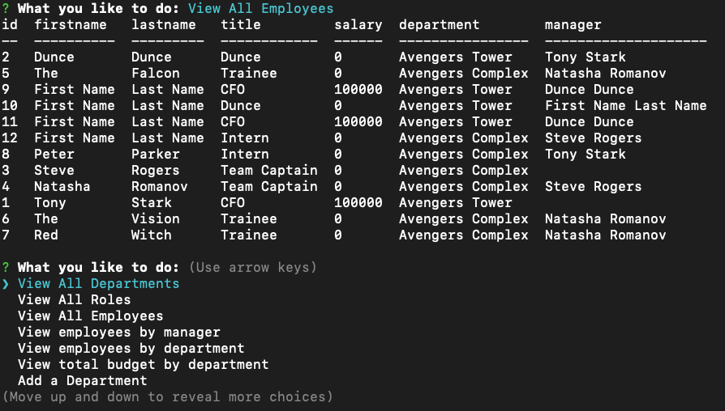

# Employee     

# Table of Contents
- [Project Description](#project-description)
- [Installation Instructions](#installation-instructions)
- [Usage](#usage)
- [Screenshot](#screenshot)
- [Walkthrough Videos](#walkthrough-video)  
- [How To Contribute](#how-to-contribute)
- [Testing Instructions](#testing-instructions)
- [Technology](#technology)
- [Questions](#questions)
- [License](#license)

# Project Description
This small command line interface (CLI) application will prompt the user to provide information that will be used to create a HTML
profile page for a team.  Starting with the Team Manager and their details (employee Id, name, email, office number), the user will
be repeatedly prompted to add another employee, either an Engineer or an Intern, with slightly different details (github username and school respectively).
When the user is finished an HTML page will be generated that displays the Team Profile.

# Installation Instructions

1.  Install [node.js](http://nodejs.org)
2.  Using the installed Node Package Manager `npm`, execute `npm install` to install the required libraries.

# Usage

To execute the application, use a command line interface (CLI) such as terminal (or in windows command) and execute `npm run start` or alternatively `node index.js`

# Screenshot

# Walkthrough Video

1.  Unit Testing  [walkthrough part 1](https://drive.google.com/file/d/1-oK6Xb5BSsQx2W11IBQ1Cy3Dvn80cxBB/view)
2.  Team Profile Generation Process [walkthrough part 2](https://drive.google.com/file/d/1m9UDnPNW076lJxg8-3GgiFK9iNss1f1f/view)
3.  Team Profile Page (that was generated in step two) [walkthrough part 3](https://drive.google.com/file/d/1WKsoUJymRndscLCjkvQJNJyVkWHgBBYx/view)

## How to contribute

Please access the [Questions](#questions) section to send me an email, or access the repository link if you wish to help contribute to this project.

# Testing Instructions

1.  Use a command line interface (CLI) such as terminal (or in windows command) and execute `npm run test` to run the unit tests for the Employee class and it's subclasses.
2.  Use a command line `...` and execute `npm run renderEmployees` to test the employee renderer and see the output in the console.
3.  Use a command line `...` and execute `npm run renderPage` to test the html page renderer and generate a replacement `/dist/index.html` with test data.

# Technology

1. [Node.js](http://nodejs.org)
2. NPM
3. [Inquirer](https://npmjs.com/package/inquirer)
4. [Moment](https://npmjs.com/package/moment)
5. [Markdown License badges](https://gist.github.com/lukas-h/2a5d00690736b4c3a7ba)
6. [Jest](https://jestjs.io/)
7. [Bootstrap](https://getbootstrap.com/)
8. [Typescript](https://www.typescriptlang.org/)
9. [Babel](https://babeljs.io/)

# Questions

>  **Direct your questions about this project to:**
>
>  *GitHub:* [Github Project Link](https://github.com/jsharples777/week-13-homework)
>
>  *Email:* [jamie.sharples@gmail.com](mailto:jamie.sharples@gmail.com)

# License

### [MIT License](https://opensource.org/licenses/MIT)
A short and simple permissive license with conditions only requiring preservation of copyright and license notices. Licensed works, modifications, and larger works may be distributed under different terms and without source code.